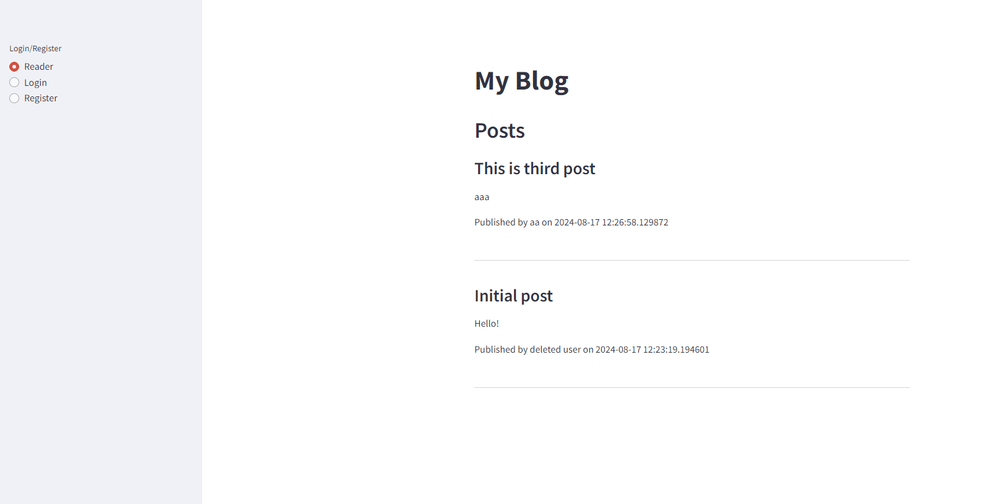
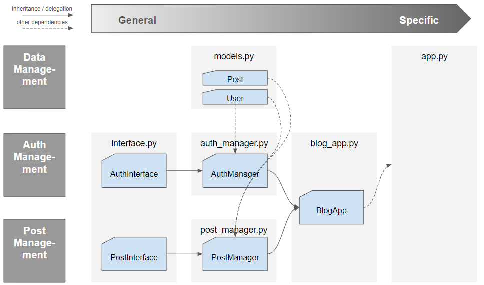

# Introduction
## What is this?
- This is a blog app with Streamlit.
- For editors, this provides simple but useful blog funcgtions:
    - This app expects to use for group of editors.
    - Only those who know admin pass can create account and edit posts.
- For a beginer developer, this app helps you how sreamlit works.
- I've published this app [here](https://blogapp-nobu-2024.streamlit.app/), so visit my app if you are interested in.

## What can you do?
- User authentification
- Publish / Edit / Delete your blog posts
- User management (Create / Delete)

## How does it work?


## How can you start?
1. set up config
Create ".streamlit/secrets.toml" in your env as follows:
```toml
[AdminPassword]
admin_password = **your password**
```

2. clone the repo
```bash
git clone **repo**
```

3. install dependencies
```bash
pip install -r requirements.txt
```

4. run app
```bash
streamlit run app.py
```

# Tech side
## Tect stach
The code is developed with python. The following packages are utilized:
- Frontend:
    - Streamlit
- Data handling:
    - SQLAlchemy
- Test:
    - pytest
    - unnittest
    - GitHub Actions

## Software Architecture
Classes used in the app are designed to be alined with onject oriented programming principals. Each class and file have dependencies as follows:



## Deploy
Through streamlit cloud, you can easily deploy and publish your app!

1. Sign up [streamlit cloud](https://streamlit.io/cloud)
2. Create up from your github repo
3. [Edit secrets](https://docs.streamlit.io/deploy/streamlit-community-cloud/deploy-your-app/secrets-management)

That's it!