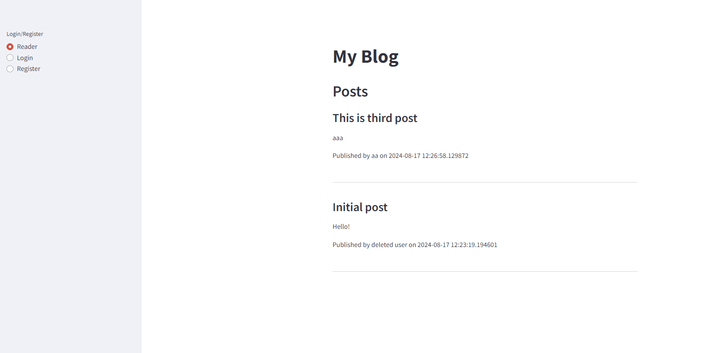

# What is this?
- This is a sample blog app
- This app expects to use for group of editors
- Only those who know admin pass can create account and edit posts

# What can you do?
- User authentification
- Publish / Edit / Delete your blog posts
- User management (Create / Delete)

# Tech stack
- SQLAlchemy
- Streamlit

# How does it work?


# How can you start?
1. set up config
Create "./env/user_auth.py" in your env as follows:
```python
ADMIN_USERNAME = "your admin name"
ADMIN_PASSWORD = "your password"
```

2. clone the repo
```bash
git clone [repo]
```

3. install dependencies
```bash
pip install -r requirements.txt
```

4. run app
```bash
streamlit run app.py
```